# AVR AC SPOT WELDER 매뉴얼

## 외관

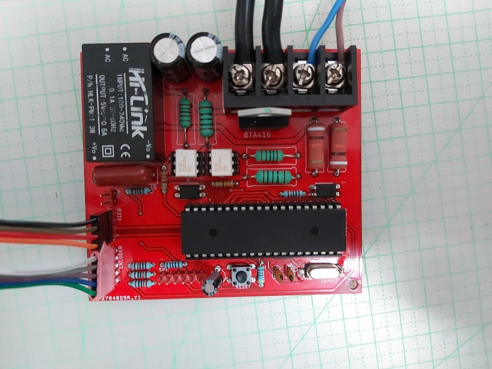

ATMEGA16 MCU를 사용 하여 제작되었으며 12C CLCD DISPLAY를 사용하고 로타리
엔코더 스위치를 사용하여

제어 할수 있습니다.

모든 조작은 로타리 엔코더 스위치를 이용하여 가능 합니다.

모든 시간과 값 조절은 다이얼을 조절하여 가능합니다.

모든 메뉴를 들어가거나 값을 저장할 땐 스위치를 누르면 됩니다 또한 저장과
동시에 이전 메뉴로 나오게 됩니다.

그리고 모든 메뉴를 나올 때는 메뉴 마지막에 EXIT 가 있습니다.

EXIT를 누르면 이전 메뉴로 나오게 됩니다.

\*스위치를 정확하게 눌러주세요. 노브가 애매하게 걸려있거나 스위치가
어중간하게 눌리시에는

인식하지 않습니다. 길게 누르고 있으라는 게 아닙니다. 짧게 누르되
정확하게 꾹 눌러주시면 됩니다.

사용해 보시면 금방 아실겁니다.

\*물기나 땀이 찬 손으로 엔코더 회로 뒷면을 잡지 마세요. 오작동의 원인이
됩니다.

(엔코더가 GPIO PORTB를 사용합니다. PORTB는 SPI 통신을 같이 사용하는
포트입니다. 회로에 직접적인 영향이 갑니다)

이 회로에는 AUTO SPOT 이 내장되어 있습니다.

기존 다른 분들이 아두이노에서 사용되는 리드방식과는 차이가 있습니다.

이 방식이 아두이노 에서 사용되는 방식보다 더 좋다거나 이런 건 절대
아닙니다.

아두이노 도 똑같은 AVR을 사용하기 때문에 아두이노로 하는게 더 효율적이고
구현도 깔끔합니다..

그리고 계산되는 방식이 다른거지 다른건 거의 모든회로가 다 똑같습니다.

저도 처음엔 다른분들이 짜놓으신 소스를 따라갈려 했으나 컴파일러가
다르다보니

짜다보니 다른방식을 사용하게 되었습니다.

제 회로에 사용된 오토스팟 리드 방식은 회로의 출력단자에 스너버를
사용하여 미세한 전류를 흘려 전압을 걸어주게 됩니다.

일반적으론 이 전압으로 인해 트랜스에 걸리는 2차 전압을 읽어 ADC로
리드하는 것이 일반적 이지만 저는 출력단자에서 읽어 들어올수 있는 방법을
생각했습니다. 하지만 이 방식에는 트랜스가 작동을 하면 PC814가 망가져
버리는 문제가 발생을 합니다. 따라서 MOC3021을 사용하여 PC814의 입출력을
제어하고 PC814의 값을 읽어드릴때만 작동 하도록 설계가 되었습니다. 따라서
ADC로 전압을 읽어서 전압의 평균과 최댓값과 최소값의 편차를 구하고 평균값
-- 리드값 하여 이 값을 RMS 값이라 부릅니다. 그리고 편차의 값에 divide_pp
값을 나누어 그 값을 voltage_pp값이라 부르고 그 값을 백단위 숫자로
환산합니다. 그리하여 동봉의 접촉전후의 편차를 극대 화 시켜 값의 최댓값을
저장하고 inte_stan_value 라고 합니다. 그리고 매 스폿시 동봉 접촉후의
값이 inte_stan_value 와 일치하면 스폿이 실행 되게 됩니다. 따라서
오토스팟을 사용하기전 divide_pp 값을 구하여 스팟에 사용될 백단위 숫자를
미리 설정 해 주어야 합니다.

\*리드값 : 항상 읽어 들어오는 adc 값

devide_PP값 계산을위한 순서는 이러합니다.

1.  동봉 접촉전의 pp값 계산(un_devide_pp)

2.  동동 접촉후의 pp값 계산(c_devide_pp)

3.  두값을 더한 후 2로 나눔.(devide_pp)

un_max_min_mean = 접촉전의 전압의 편차

c_max_min_mean = 접촉후의 전압의 편자

un_devide_pp = un_max_min_mean/un_pp;

c_devide_pp = c_max_min_mean/c_pp

devide_pp = (un_devide_pp + c_devide_pp)/2

입니다.

그리고 백단위로 환산하기전의 값

voltagepp = (편차/$\alpha$) /(devide_pp/$\beta$)

입니다.

($\alpha,\beta$는 값을 정확성과 오차율을 줄이기 위해 제가 구한
상수입니다)

이 값에 rms값(RMS값은 정상적일 경우 항상 거의 0에 수렴함)을

뺀후 백단위로 환산하여 저장하게 됩니다.

그리고 매 스폿시 값을 리드하여 이 값과 일치하면 스폿이 실행 됩니다.

따라서 un_pp 갑과 c_pp값을 설정해 주어야합니다.

이 값에 따라 devide_pp의 값이 변화하여 인식률에 영향을 줍니다.

설정범위는 두 값 전부 0.1\~10 이며 이값에 따라 백단위 숫자가 바뀌게
됩니다.

또한 니켈의 전도율에 따라 값을 맞춰 주시면 됩니다. auto spot 메뉴에서
설정 가능합니다.

값 리드 과정을 궁금해 하실 분들을 위해 적어두기는 합니다만

소스를 넣어두려다 더 복잡해질 것 같아 뺍니다.

어려우신 분 들은 패스 하셔 도 됩니다. 아래 설정방법이 나와 있습니다.

제가 100번도 넘게 테스트 했기에 애지간하면 바로바로 잘 됩니다.

아래 설정만 따라와 주셔도 사용하는데는 지장없이 잘 됩니다.

## 배선


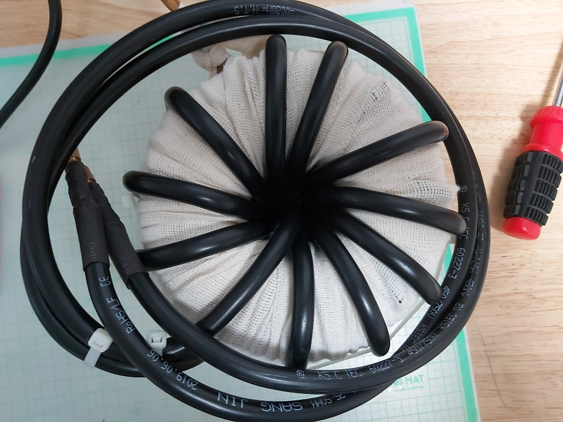

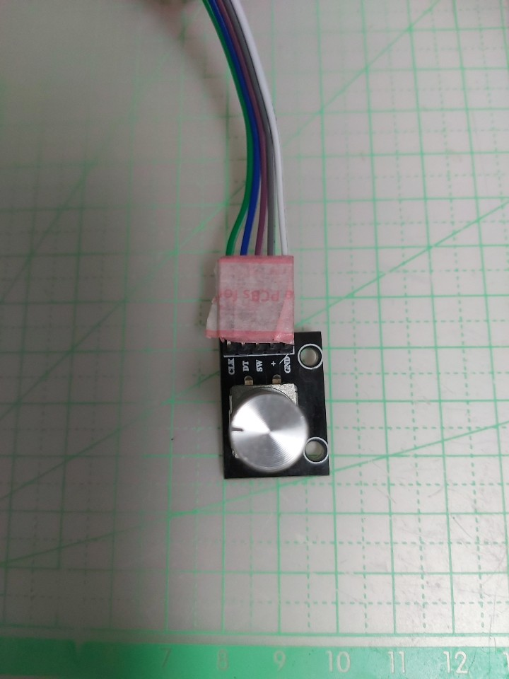

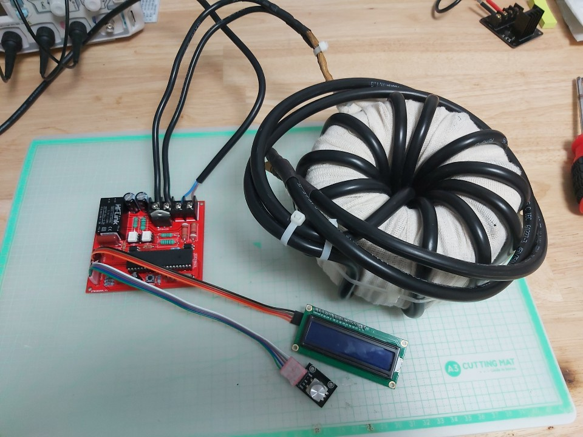

LCD 와 엔코더는 사진처럼 일직선으로 연결해주시면 됩니다.

## 오토스팟 설정방법

1. 세팅으로 들어갑니다.

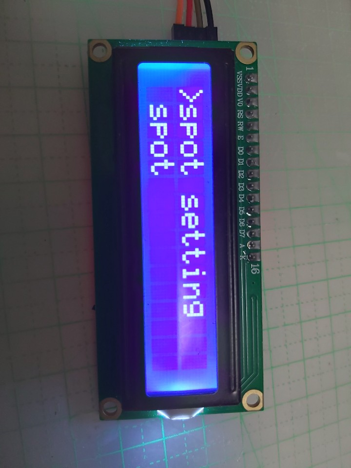

2. 오토스팟 메뉴로 들어갑니다.

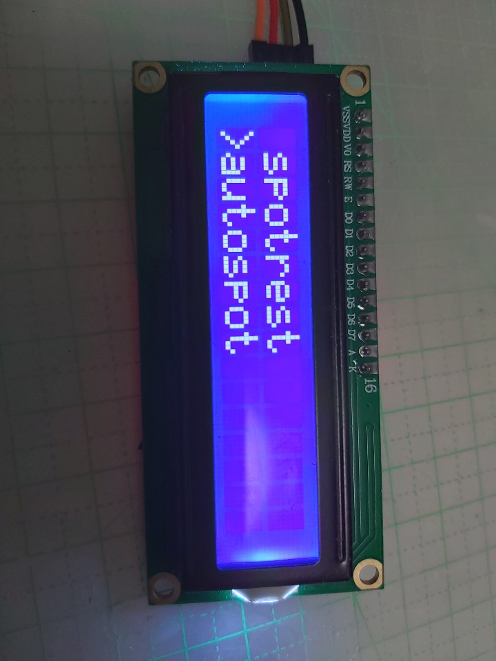

auto spot 메뉴에서 오토스팟을 켜고 끌수 있습니다.

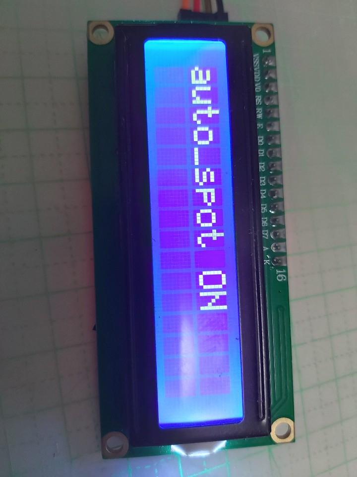

3. 노브를 돌려 standard_set 메뉴로 들어가주세요.

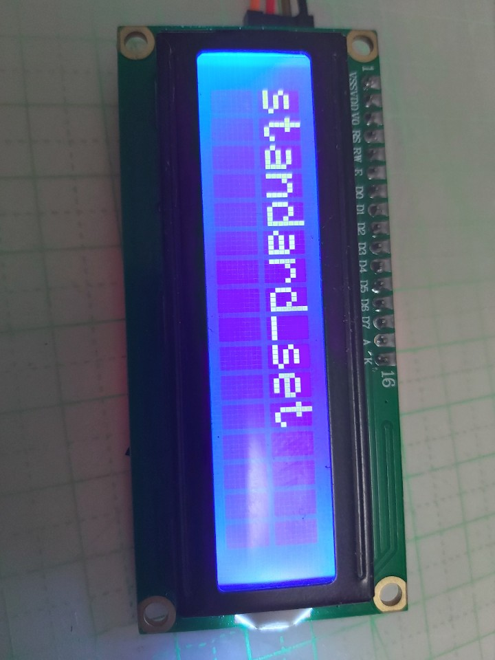

4. 들어가시면 사진과 같은 메뉴를 보실겁니다.

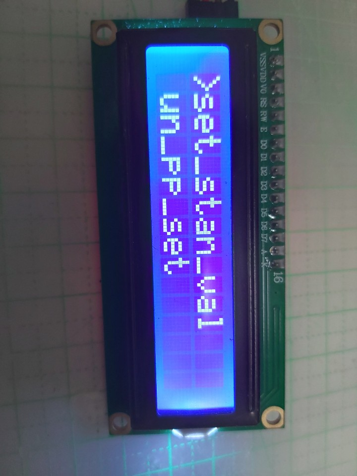

set_stan_val : 오토스팟 사용을 위한 devide_pp값 계산 함수

un_pp_set : 동봉의 닫기전의 devide_pp 값

c_pp_set : 동봉이 닿은후의 devide_pp 값

set_stan_val을 하기전 un_pp 값과 c_pp값을 설정 해주셔야 합니다.

각각의 메뉴로 들어가서 값을 설정해주세요.

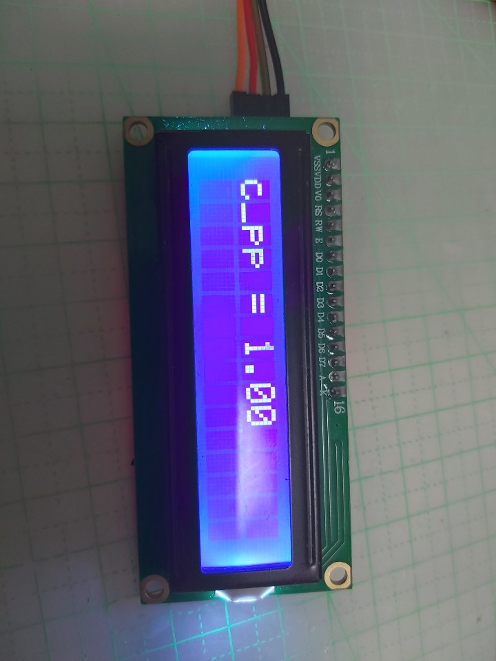

un_pp값과 c_pp값을 활용하여 오토스폿 인식 값으로 사용될 값을 계산하게
됩니다.

초기설정 은 두 개가 0.2로 되어있을겁니다.

un_pp값이 c_pp 값보다 0.1\~0.2 정도 낮게 설정해주시면 됩니다.

5. 저장한 후 나와서 set_stan_val로 들어가주세요.

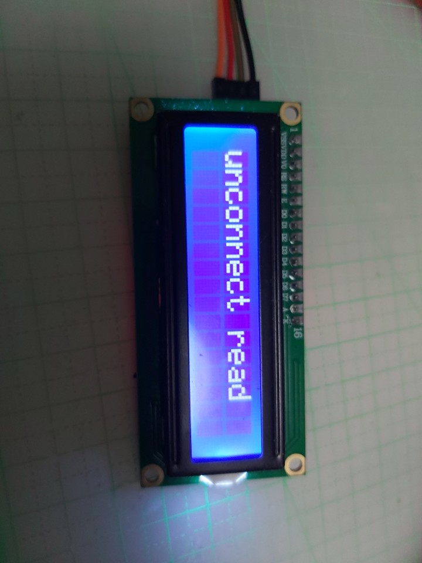

그럼 이화면이 보일겁니다. 동봉 접촉전의 값을 계산 하는 겁니다. 이상태
에서는 아무것도 건들지마지고 가만 나둬 주세요.

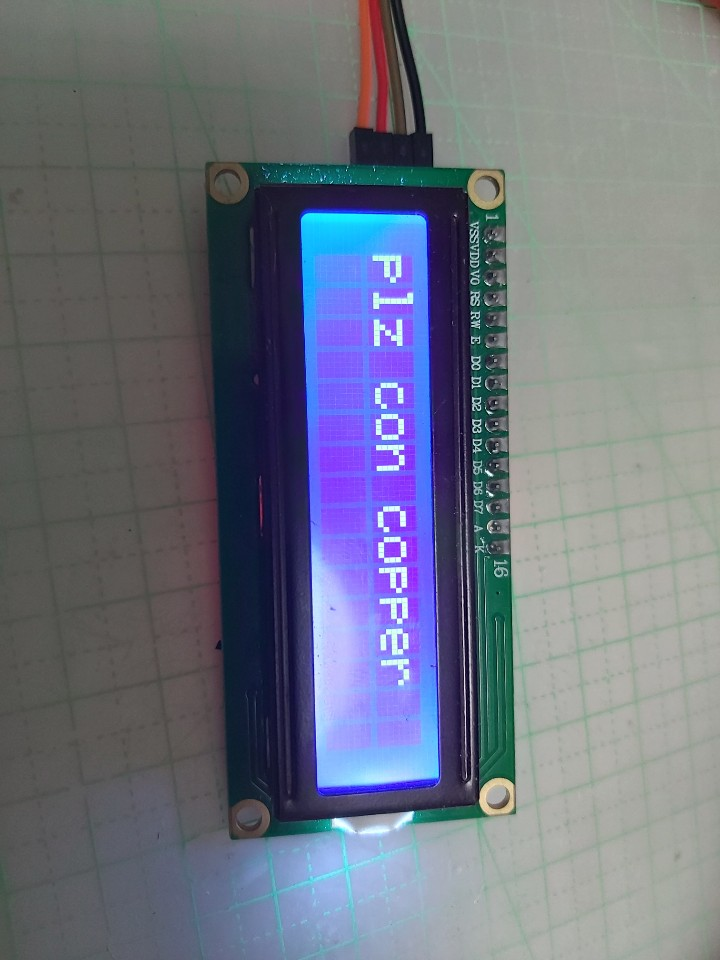

위 화면에서 2초정도 지나면 사진 속 화면으로 넘어옵니다. 이 상태에서
동봉을 니켈과 접촉 시켜주세요. (니켈과 가볍게 접촉 시켜 주세요.
(\*동봉끼리 닿으면 안됩니다.) 전도율 높인다고 너무 쎄게 접촉시키시면
스팟시 백단위 값이 높아져 그만큼 인식률이 낮아지므로 인식 시간이
길어집니다.)

반대로 값을 낮게 해놓고 너무 강하게 누르시면 설정된 값보다 높게 인식되어
인식이 안될 수 있습니다. 여기서 설정 할 때 힘 조절을 해 주세요. 여기서
힘을 약하게 주고 인식 시키 면 스팟을 할때도 약하게 주고 하여도 됩니다.
반대도 힘을 많이 주고 인식하면 스폿 할 때도 힘이 많이 들어갑니다.

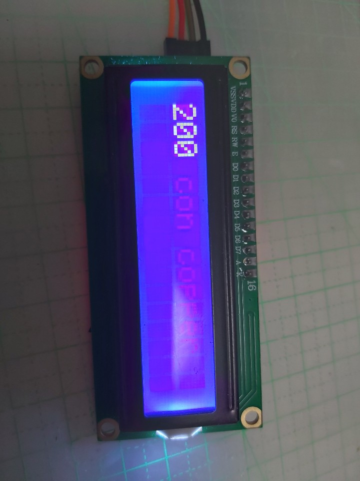

동봉을 접촉시키고 있다가 이 화면이 뜨면 때셔두 됩니다.

설정한 c_pp 값과 un_pp값에 따라 숫자는 다르게 뜰겁니다.

저 값이 200\~1000 사이의 값이면 정상입니다.

값이 지나치게 높거나 또는 낮다면 c_pp값과 un_pp값을 조절하여 값을 맞춰
주세요.

현재는 저는 700w 전자렌지 트랜스와 3k 링코어로 테스트를 하였고

제 테스트값에 준한 설정값입니다. 값을 변환해 가며 맞는 값을 찾아주세요.

```text
un_pp = 0.2
c_pp = 0.2
일 경우
200

un_pp = 0.3
c_pp = 0.5
일 경우
400
```

이 두가지 설정을 제가 테스트 시 가장 많이 사용한 값입니다

그리고 값은 트랜스에 따라 변할 수 있습니다. 무조건 설정에 저 값이 나오지
않을 수 있습니다.

사용하시는 트랜스나 링코에 따라 값을 바꿔가며 설정해 보세요.

값에 영향을 주는 요인은 여러 가지가 있습니다.

크게는 트랜스의 용량이 과 2차권선의 길이입니다.

3k 링코어 사용시 최소한 25 스퀘어 짜리 10바퀴는 감아주시는걸 추천합니다.

16 스퀘어짜리는 출력을 전부 내지 못할겁니다.

그리고 퓨즈는 20A를 사용해주시면 되겠습니다.

그리고 안전을 위해 누전차단기를 달아서 전원을 제어 하시는걸 추천합니다.

오토스팟 값 설정은 트렌스 및 링코어를 교체했거나

회로를 처음 사용하실 때 한번만 설정 해 주시면 됩니다.

그 이후에는 값이 저장되어 알아서 인식합니다.

모든 설정을 마친후 exit를 눌러 나오게 되면 자동으로 auto spot 메뉴로
들어오게 됩니다.

그러면 auto spot ON을 눌러 오토스풋을 켜주시면 오토스팟이 활성화
됩니다.(OFF 로 설정하시면 SW 모드 활성화)

그리고 오토스팟 설정 후에는 리셋을 한번 해주세요. 안하신다고 문제가
되는건 아니라만

해주시는 걸 추천합니다.(회로 ic 하단에 reset단추 있음)

그리고 SPOT 메뉴로 들어가게 되면 AUTO 라고 뜰겁니다, 그러면 오토스팟
모드이고

MANUAL 라고 뜨면 SWITCH 모드입니다. 회로에 SW 라고 있는 부분에 스위치를
연결하여 사용하시면 됩니다.

회로내에 장치가 다 내장되어 있으므로 스위치에 별도의 장치는 안하셔두
됩니다.

그리고 본 회로에는 워치독이 작동중입니다. 인터럽트나 타이머에 문제가
생기면 자동으로 리셋합니다.

사용중간에 리셋 된다고 망가진게 아닙니다. 정상인겁니다.

그리고 가끔가다 전원 켰는데 화면에 불만 들어오고 화면이 안뜰때가
있을겁니다. 거의 없을 겁니다.

그렇다고 아예 없다고는 말 못합니다. 제가 그걸 잡을라고는 노력은 했으나
불가능합니다.

twi를 사용하는 lcd 특성상 twi는 ack 신호를 사용하는 동기식
통신방식입니다.(TWI=12C,같은 말입니다.)

이 통신신호가 틀어지면 안뜨는겁니다. 가끔 OLED 사용하시는 분들중에
화면이 갑자기 멈춰요.

화면이 안 넘어가요.등등 한 1\~2분 전원 꺼놓고 있다가 키면 정상적으로
되죠.

네\...다 같은 이유입니다. 근데 이 문제는 방법이 없어요.. 거의
없을겁니다.

그리고 전원을 연속적으로 켰다 껏다 하면 현상이 아주 잘나타납니다.

전원을 켰다껏다하면 신호가 정상적으로 티밍이 될 수가 없죠..

제가 100번도 넘게 테스트를 해본 결과 이제는 거의 안정화 가 돼서 거의
안뜨는 일은 없으나 가끔가다

이런 현상을 목격시 놀라지 마시고 RESET을 눌러주시면 됩니다\....\^\^;;
부디\....
